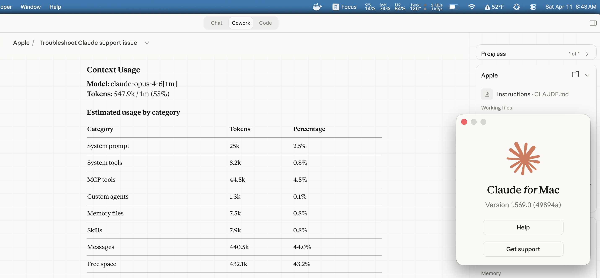

<p align="center">
  
</p>

<h1 align="center">claude-cowork-1m-patch</h1>

<p align="center">macOS patch that restores 1M-token context in Claude Cowork</p>

<p align="center"><em>two same-length JS byte swaps &bull; re-signed bundle &bull; fully reversible</em></p>

<p align="center">
  
  
  
  
</p>

---

> [!WARNING]
> Auto-updates overwrite the patch - re-run `./patch-claude-1m.sh` after each Claude Desktop update.

## Table of Contents

- [Quick Start](#quick-start)
- [The Problem](#the-problem)
- [Scope](#scope)
- [Compatibility](#compatibility)
- [Inspect before running](#inspect-before-running)
- [Verify success](#verify-success)
- [Rollback](#rollback)
- [Root Cause](#root-cause-deep-dive) · [How It Works](#how-it-works--four-integrity-layers) · [Log Evidence](#log-evidence)
- [Caveats](#caveats)
- [Further Reading](#further-reading)
- [Related Issues](#related-issues)
- [Legal](#legal)

## Quick Start

```bash
./patch-claude-1m.sh
```

The script handles everything: backs up the original asar, patches the feature flag, updates all integrity hashes, and re-signs the app with preserved entitlements.

After it finishes, restart Claude Desktop and start a new Cowork session:

```bash
osascript -e 'quit app "Claude"'; sleep 3; open -a Claude
```

**Prerequisites:** Node.js, Python 3, macOS with Claude Desktop installed. The script auto-installs `@electron/asar` to a temp directory if it's not already available.

## The Problem

Feature flag `3885610113` controls whether the Cowork model resolution function appends `[1m]` to model names. On 2026-03-19, the flag was rolled back server-side - same app version, same session setup, different behavior. Log timestamps confirm the boundary: `18:36` `[1m]`, `19:59` no `[1m]`. The CLI was unaffected; only Desktop's `LocalAgentModeSessionManager` was broken.

17+ users reported it across GitHub issues [#37413](https://github.com/anthropics/claude-code/issues/37413), [#36760](https://github.com/anthropics/claude-code/issues/36760), [#36351](https://github.com/anthropics/claude-code/issues/36351), and [#33154](https://github.com/anthropics/claude-code/issues/33154) with no resolution after over a month of silence from Anthropic. Max subscribers ($200/month) are paying for 1M and getting 200K.

## Scope

This script is intentionally narrow.

**Modifies, locally only:**
- `/Applications/Claude.app/Contents/Resources/app.asar` - two same-length JS byte swaps
- `/Applications/Claude.app/Contents/Info.plist` - recomputed asar header hash

**Reads:**
- The local app bundle and its current code-signing entitlements

**Network:**
- Installs `@electron/asar@4.2.0` from npm into a temp dir if not already present (with `--ignore-scripts`). Preinstall it to skip this step.
- No calls to Anthropic APIs.

**Backups (created before any mutation):**
- `~/Desktop/app.asar.backup-YYYYMMDD-HHMMSS`
- `~/Desktop/Info.plist.backup-YYYYMMDD-HHMMSS`

> [!NOTE]
> **Fails closed:** if the script can't recognize the asar shape, it exits with `unknown` rather than half-patch. No `sudo` required.

## Compatibility

| Claude Desktop version | Layer 1b form | Status | Last tested |
| --- | --- | --- | --- |
| 1.569.0 | regex | works | 2026-04-18 |
| 1.3109.0 | array | works | 2026-04-20 |

Versions in between are likely fine but haven't been verified. If the byte anchors don't match either form, preflight exits `unknown` instead of guessing - see [CHANGELOG.md](CHANGELOG.md) for what changed when.

## Inspect before running

Audit what the script touches and what network it uses:

```bash
grep -nE 'npm|curl|wget|ssh|scp|rsync' patch-claude-1m.sh
grep -nE '/Applications/Claude.app|Info.plist|app.asar' patch-claude-1m.sh
bash -n patch-claude-1m.sh
```

To skip the npm install entirely, preinstall the pinned dependency yourself:

```bash
npm install -g @electron/asar@4.2.0
```

## Verify success

A successful run prints:

```
Layer 1a (feature flag): BYPASSED
Layer 1b (model allow-list): BROADENED
Virtualization entitlement: PRESENT
```

Then quit and relaunch Claude, start a **new** Cowork session, and confirm `[1m]` is being passed to the spawned model:

```bash
tail -f ~/Library/Logs/Claude/cowork_vm_node.log | grep -- '--model'
```

You should see `--model claude-opus-4-7[1m]` (or `claude-opus-4-6[1m]`).

<p align="center">
  
</p>

## Rollback

Restore from the backup the script created on your Desktop:

```bash
cp ~/Desktop/app.asar.backup-YYYYMMDD-HHMMSS \
   /Applications/Claude.app/Contents/Resources/app.asar
cp ~/Desktop/Info.plist.backup-YYYYMMDD-HHMMSS \
   /Applications/Claude.app/Contents/Info.plist
osascript -e 'quit app "Claude"'; sleep 2; open -a Claude
```

> [!TIP]
> If macOS rejects the rolled-back app with "Invalid installation" or a Gatekeeper block (the bundle's outer signature still references the patched files' hashes), the cleanest recovery is to reinstall Claude Desktop from <https://claude.ai/download> - about a minute, and you get a fresh signed copy.

<h2 id="root-cause-deep-dive">Root Cause (deep dive)</h2>

The model-resolution function in `app.asar` has two JS gates that both must pass for `[1m]` to be appended: a server feature-flag check (`3885610113`) and a model allow-list. The flag rollback on 2026-03-19 broke the first gate for every Cowork user; the `opus-4-7` rollout on 2026-04-18 broke the second for 4-7 sessions. The flag ID is the stable Layer 1a anchor; Layer 1b exists in two forms (regex for Claude Desktop < v1.3109, JS array for ≥ v1.3109) which the preflight auto-detects.

For the full narrative (how the flag was found, why extract/repack fails, how each regression was diagnosed) see [docs/root-cause-analysis.md](docs/root-cause-analysis.md). For the per-layer byte-swap spec see [docs/integrity-layers.md](docs/integrity-layers.md).

<h2 id="how-it-works--four-integrity-layers">How It Works - Four integrity layers</h2>

The app enforces four integrity layers that all break when any file changes. The patch updates them in sequence:

| Layer                       | What it checks                                                       | How the patch handles it                                                                                                                                                                                                                 |
| --------------------------- | -------------------------------------------------------------------- | ---------------------------------------------------------------------------------------------------------------------------------------------------------------------------------------------------------------------------------------- |
| **1. JS application logic** | Two gates in the model-resolution function: server feature flag + model allow-list. | Two same-length JS swaps. Layer 1b's form (regex vs array) rotated between app versions; the preflight auto-detects. Spec: [docs/integrity-layers.md § Layer 1](docs/integrity-layers.md#layer-1---application-logic-two-js-gates). |
| **2. Per-file integrity**   | SHA256 of `index.js` in asar header                                  | Recompute file hash + block hashes, replace in header (same-length). |
| **3. Header integrity**     | SHA256 of asar header in `Info.plist`                                | Recompute via `@electron/asar` `getRawHeader()`, write to plist.     |
| **4. Code signature**       | macOS entitlements for Cowork's VM sandbox                           | Extract original entitlements before patching, re-sign with `--entitlements` (not `--deep`). |

All JS replacements must be same-length - any offset shift invalidates V8's compiled bytecode cache and the app crashes on launch. This is why extract/repack doesn't work. Full per-layer detail: [docs/integrity-layers.md](docs/integrity-layers.md).

<details>
<summary><h2 id="log-evidence" style="display:inline">Log Evidence</h2></summary>


| Timestamp               | Event                                                                                                                                                                     |
| ----------------------- | ------------------------------------------------------------------------------------------------------------------------------------------------------------------------- |
| 2026-03-18 06:51        | `[1m]` first observed in Cowork sessions                                                                                                                                  |
| 2026-03-19 18:36:58     | **Last working session** - `model: claude-opus-4-6[1m]`                                                                                                                   |
| 2026-03-19 19:59:08     | **First broken session** - `model: claude-opus-4-6` (same app version, flag rollback)                                                                                     |
| 2026-03-31 → 2026-04-06 | 110 consecutive sessions, all without `[1m]`                                                                                                                              |
| 2026-04-03 09:08        | Context window exceeded error - confirmed hitting 200K wall                                                                                                               |
| 2026-04-18 20:19:30     | Last working `opus-4-6[1m]` session under flag-bypass-only patch                                                                                                          |
| 2026-04-18 20:19:53     | **Second regression** - first `opus-4-7` session, no `[1m]`. Same app version (1.569.0), flag-bypass patch still installed. Model allow-list regex doesn't recognize 4-7. |
| 2026-04-19 → 04-20      | **v1.3109.0 regex→array refactor discovered.** Preflight updated to detect both forms; see [CHANGELOG.md](CHANGELOG.md) and [docs/root-cause-analysis.md § April 19–20 2026](docs/root-cause-analysis.md#april-1920-2026---form-b-discovered-regex--array-refactor). |

</details>

## Caveats

- **Auto-updates overwrite the patch.** Re-run `./patch-claude-1m.sh` after each Claude Desktop update.
- **Minified names change between versions.** The script matches by stable byte anchors (flag ID + Layer 1b form); minified variable names are never relied on. When Anthropic refactors the gate again, expect to add a Form C - see [docs/integrity-layers.md § Layer 1](docs/integrity-layers.md#layer-1---application-logic-two-js-gates) for the current anchor set.

> [!IMPORTANT]
> **Opus-only scope.** Layer 1b matches `opus-4-6` and `opus-4-7` only. `sonnet-4-6` is intentionally dropped so the rule is deterministic (as of April 2026: sonnet `[1m]` is billed at API rates; opus `[1m]` is bundled in Max - auto-suffixing sonnet would silently route bundled usage onto a metered tab). If/when `opus-4-8` ships, update the Layer 1b anchor in `patch-claude-1m.sh` or open an issue.

- **The script is intentionally conservative.** If it can't recognize the current build, it exits with `unknown` rather than half-patch. Re-run safely.
- **This modifies the app binary.** The script creates a backup on every run. Fully reversible (see Rollback).
- **The `ANTHROPIC_DEFAULT_OPUS_MODEL` env var doesn't help.** `LocalAgentModeSessionManager` has its own model resolution path that ignores environment overrides.
- **ToS:** This is a personal workaround for a documented regression affecting paying customers. Use at your own risk.

## Further Reading

- [CHANGELOG.md](CHANGELOG.md) - what changed when, by Claude Desktop version
- [docs/integrity-layers.md](docs/integrity-layers.md) - the four integrity layers in detail
- [docs/root-cause-analysis.md](docs/root-cause-analysis.md) - how the flag was found, why extract/repack fails
- [Project writeup](https://evanjcosgrove.github.io/claude-cowork-1m-patch/) - the narrative version of the same material
- [Discussions](https://github.com/evanjcosgrove/claude-cowork-1m-patch/discussions) - Q&A, version-compat chatter, bug-report template

## Related Issues

- [anthropics/claude-code#37413](https://github.com/anthropics/claude-code/issues/37413)
- [anthropics/claude-code#36760](https://github.com/anthropics/claude-code/issues/36760)
- [anthropics/claude-code#36351](https://github.com/anthropics/claude-code/issues/36351)
- [anthropics/claude-code#33154](https://github.com/anthropics/claude-code/issues/33154)

## Legal

> [!NOTE]
> This repository provides a local patch script and documentation. It does not distribute Anthropic's code, bypass DRM or encryption, or access Anthropic's servers beyond the normal API calls your plan authorizes. You are responsible for evaluating whether use complies with applicable terms and laws in your jurisdiction.
